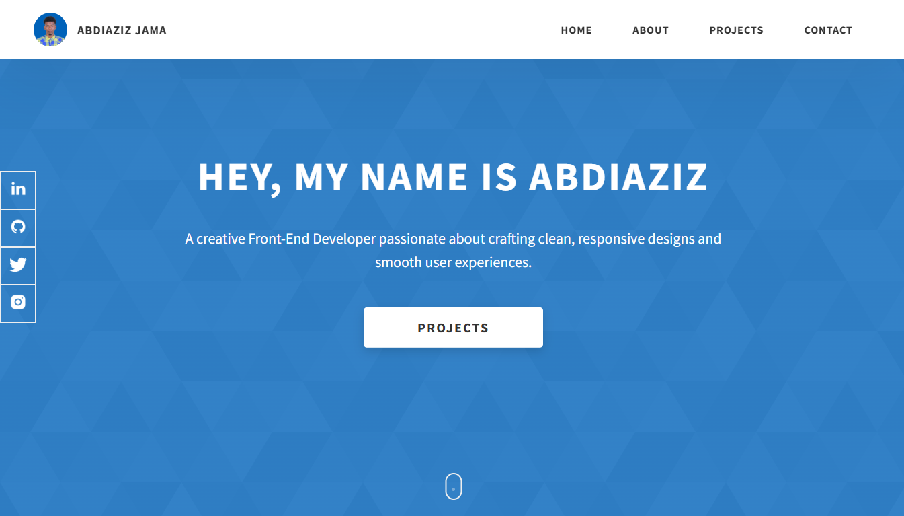

# Overview
Aziz Portfolio is a personal website inspired by Dopefolio its showcasing my skills, projects, and experience as a frontend web developer. Built with modern web technologies like HTML, CSS, JavaScript, React.js, and Bootstrap, the portfolio features a clean, responsive, and user-friendly design. It includes sections such as About Me, Skills, Projects, and Contact, allowing visitors to explore my work and connect easily.

The goal of this portfolio is to highlight my expertise in crafting interactive and visually appealing websites, demonstrating my ability to build seamless user experiences.

## LiveSite 

abdiaziz-portfolio: (https://abdiaziz-portfolio.netlify.app/)

## Screenshots

